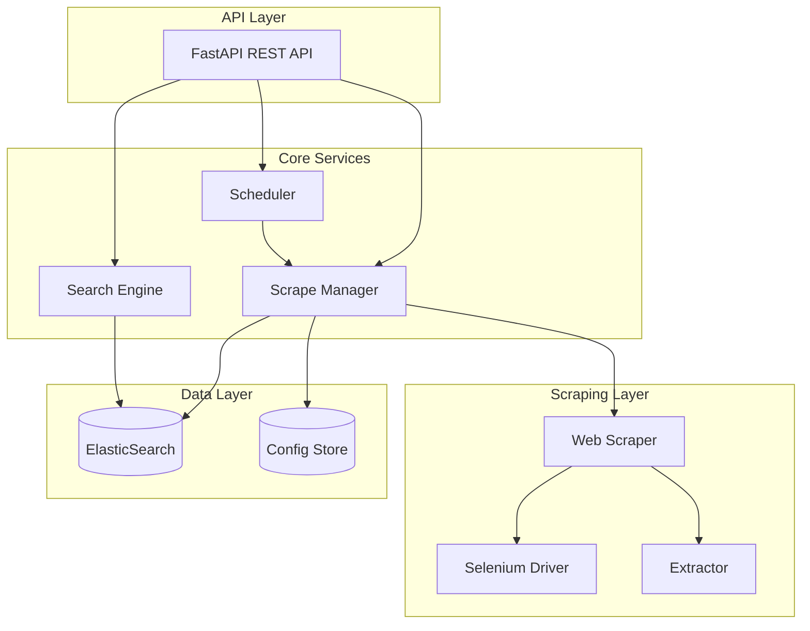

# Design Document: Info Hunter

## Overview

Info Hunter is a Python-based data aggregation platform that scrapes web content using Selenium and stores/searches data using ElasticSearch. The system follows a modular architecture with clear separation between scraping, data processing, storage, and API layers.

The platform supports multiple data source types (scholarships, internships, prices, learning resources) through a configurable extraction rule system, enabling users to define custom scraping targets without code changes.

## Architecture



## Components and Interfaces

### 1. Data Source Manager

Handles CRUD operations for data source configurations.

```python
class DataSourceManager:
    def create_source(self, config: DataSourceConfig) -> DataSource:
        """Create and validate a new data source configuration."""
        pass
    
    def get_source(self, source_id: str) -> Optional[DataSource]:
        """Retrieve a data source by ID."""
        pass
    
    def list_sources(self, source_type: Optional[SourceType] = None) -> List[DataSource]:
        """List all data sources, optionally filtered by type."""
        pass
    
    def update_source(self, source_id: str, config: DataSourceConfig) -> DataSource:
        """Update an existing data source configuration."""
        pass
    
    def delete_source(self, source_id: str) -> bool:
        """Delete a data source configuration."""
        pass
    
    def validate_config(self, config: DataSourceConfig) -> ValidationResult:
        """Validate extraction rules and URL patterns."""
        pass
```

### 2. Web Scraper

Executes scraping jobs using Selenium.

```python
class WebScraper:
    def __init__(self, driver_options: DriverOptions):
        """Initialize scraper with Selenium driver configuration."""
        pass
    
    def scrape(self, source: DataSource) -> ScrapeResult:
        """Execute a scrape job for the given data source."""
        pass
    
    def extract_data(self, page_source: str, rules: List[ExtractionRule]) -> List[Dict]:
        """Extract data from page HTML using configured rules."""
        pass
    
    def handle_pagination(self, source: DataSource) -> Iterator[str]:
        """Yield page URLs following pagination links."""
        pass
```

### 3. Extractor

Applies extraction rules to HTML content.

```python
class Extractor:
    def extract_field(self, html: str, rule: ExtractionRule) -> Optional[str]:
        """Extract a single field using CSS selector or XPath."""
        pass
    
    def extract_all(self, html: str, rules: List[ExtractionRule]) -> Dict[str, Any]:
        """Extract all fields defined by rules."""
        pass
    
    def normalize(self, raw_data: Dict[str, Any], source_type: SourceType) -> Document:
        """Normalize extracted data into a Document."""
        pass
```

### 4. Aggregator

Manages data indexing and deduplication.

```python
class Aggregator:
    def __init__(self, es_client: ElasticSearchClient):
        """Initialize with ElasticSearch client."""
        pass
    
    def index_document(self, doc: Document) -> IndexResult:
        """Index a document, handling deduplication."""
        pass
    
    def generate_doc_id(self, doc: Document) -> str:
        """Generate unique ID from source URL and content hash."""
        pass
    
    def bulk_index(self, docs: List[Document]) -> BulkIndexResult:
        """Index multiple documents efficiently."""
        pass
```

### 5. Search Engine

Provides search and filtering capabilities.

```python
class SearchEngine:
    def __init__(self, es_client: ElasticSearchClient):
        """Initialize with ElasticSearch client."""
        pass
    
    def search(self, query: SearchQuery) -> SearchResult:
        """Execute a search query with filters."""
        pass
    
    def build_query(self, query: SearchQuery) -> Dict:
        """Build ElasticSearch query from SearchQuery."""
        pass
```

### 6. Scheduler

Manages scheduled scrape jobs.

```python
class Scheduler:
    def create_schedule(self, source_id: str, cron: str) -> Schedule:
        """Create a new scrape schedule."""
        pass
    
    def delete_schedule(self, schedule_id: str) -> bool:
        """Remove a schedule."""
        pass
    
    def list_schedules(self) -> List[Schedule]:
        """List all active schedules."""
        pass
    
    def trigger_job(self, source_id: str) -> ScrapeJob:
        """Manually trigger a scrape job."""
        pass
```

### 7. REST API

FastAPI-based REST interface.

```python
# Endpoints
POST   /api/sources              # Create data source
GET    /api/sources              # List data sources
GET    /api/sources/{id}         # Get data source
PUT    /api/sources/{id}         # Update data source
DELETE /api/sources/{id}         # Delete data source

POST   /api/jobs/trigger/{source_id}  # Trigger scrape job
GET    /api/jobs                      # List jobs
GET    /api/jobs/{id}                 # Get job status

POST   /api/search               # Search documents
GET    /api/search               # Search with query params

POST   /api/schedules            # Create schedule
GET    /api/schedules            # List schedules
DELETE /api/schedules/{id}       # Delete schedule
```

## Data Models

### DataSourceConfig

```python
@dataclass
class DataSourceConfig:
    name: str
    url_pattern: str
    source_type: SourceType  # scholarship, internship, price, learning
    extraction_rules: List[ExtractionRule]
    pagination: Optional[PaginationConfig]
    rate_limit_ms: int = 1000
```

### ExtractionRule

```python
@dataclass
class ExtractionRule:
    field_name: str
    selector: str
    selector_type: SelectorType  # css, xpath
    transform: Optional[str] = None  # optional transformation
    required: bool = False
```

### Document

```python
@dataclass
class Document:
    id: str
    source_id: str
    source_type: SourceType
    source_url: str
    title: str
    description: Optional[str]
    content: Dict[str, Any]
    scraped_at: datetime
    content_hash: str
```

### SearchQuery

```python
@dataclass
class SearchQuery:
    text: str
    source_types: Optional[List[SourceType]] = None
    date_from: Optional[datetime] = None
    date_to: Optional[datetime] = None
    page: int = 1
    page_size: int = 20
```

### SearchResult

```python
@dataclass
class SearchResult:
    total: int
    page: int
    page_size: int
    documents: List[Document]
```

### ScrapeJob

```python
@dataclass
class ScrapeJob:
    id: str
    source_id: str
    status: JobStatus  # pending, running, completed, failed
    started_at: Optional[datetime]
    completed_at: Optional[datetime]
    documents_scraped: int
    errors: List[str]
```

### Schedule

```python
@dataclass
class Schedule:
    id: str
    source_id: str
    cron_expression: str
    enabled: bool
    last_run: Optional[datetime]
    next_run: datetime
```


## Correctness Properties

*A property is a characteristic or behavior that should hold true across all valid executions of a system—essentially, a formal statement about what the system should do. Properties serve as the bridge between human-readable specifications and machine-verifiable correctness guarantees.*

### Property 1: Data Source Validation Correctness

*For any* DataSourceConfig, validation SHALL correctly identify invalid URL patterns and selectors, returning descriptive errors for invalid configs and success for valid configs.

**Validates: Requirements 1.1, 1.2**

### Property 2: Selector Type Support

*For any* valid CSS selector or XPath expression in an ExtractionRule, the Extractor SHALL successfully parse and apply the selector to matching HTML content.

**Validates: Requirements 1.3**

### Property 3: Data Source Persistence Round-Trip

*For any* valid DataSourceConfig, saving to the configuration store and then retrieving by ID SHALL produce an equivalent configuration object.

**Validates: Requirements 1.4**

### Property 4: Data Extraction Consistency

*For any* HTML content and list of ExtractionRules, the Extractor SHALL produce a dictionary containing all fields where matching elements exist, with consistent results for identical inputs.

**Validates: Requirements 2.2**

### Property 5: Document Normalization Completeness

*For any* extracted raw data and source type, normalization SHALL produce a Document with all required fields (id, source_id, source_type, source_url, title, scraped_at, content_hash) populated.

**Validates: Requirements 2.3**

### Property 6: Document ID Determinism

*For any* Document, the generated ID based on source URL and content hash SHALL be deterministic—identical content from the same source SHALL produce identical IDs, while different content SHALL produce different IDs.

**Validates: Requirements 3.2, 3.3**

### Property 7: Document Field Preservation

*For any* Document indexed and retrieved from storage, the source_url and scraped_at fields SHALL be preserved exactly as originally set.

**Validates: Requirements 3.5**

### Property 8: Search Query Filter Building

*For any* SearchQuery with source_type filters and/or date range filters, the built ElasticSearch query SHALL include the corresponding filter clauses that correctly constrain results.

**Validates: Requirements 4.2, 4.3**

### Property 9: Search Result Completeness

*For any* SearchResult, each Document in the results SHALL contain source_url, title, description (if present), and scraped_at fields.

**Validates: Requirements 4.4**

### Property 10: Cron Expression Validation

*For any* cron expression string, validation SHALL correctly identify valid cron syntax and reject invalid expressions with descriptive errors.

**Validates: Requirements 5.1**

### Property 11: API Validation Error Responses

*For any* API request that fails validation, the response SHALL include an appropriate HTTP 4xx status code and a JSON error message describing the validation failure.

**Validates: Requirements 6.4**

### Property 12: Document Serialization Round-Trip

*For any* valid Document object, serializing to JSON and then deserializing back SHALL produce an equivalent Document object with all fields preserved.

**Validates: Requirements 7.3**

## Error Handling

### Scraping Errors

| Error Type | Handling Strategy |
|------------|-------------------|
| Network timeout | Retry up to 3 times with exponential backoff (1s, 2s, 4s) |
| HTTP 4xx errors | Log error, mark job as failed, continue with other sources |
| HTTP 5xx errors | Retry up to 3 times, then mark as failed |
| Invalid HTML structure | Log warning, extract available fields, continue |
| Selector not found | Return None for field, log at debug level |
| Rate limiting (429) | Respect Retry-After header, pause scraping |

### Storage Errors

| Error Type | Handling Strategy |
|------------|-------------------|
| ElasticSearch connection failure | Retry with backoff, queue documents for later indexing |
| Index creation failure | Log error, fail job |
| Document indexing failure | Log error, continue with remaining documents |
| Duplicate detection conflict | Use optimistic locking, retry update |

### API Errors

| HTTP Status | Condition |
|-------------|-----------|
| 400 Bad Request | Invalid request body or parameters |
| 404 Not Found | Resource (source, job, schedule) not found |
| 409 Conflict | Duplicate resource creation |
| 422 Unprocessable Entity | Valid JSON but semantic validation failed |
| 500 Internal Server Error | Unexpected server error |

## Testing Strategy

### Unit Tests

Unit tests verify specific examples and edge cases:

- **DataSourceConfig validation**: Test specific valid/invalid configurations
- **ExtractionRule parsing**: Test CSS and XPath selector edge cases
- **Document ID generation**: Test hash collision scenarios
- **Cron expression parsing**: Test valid/invalid cron formats
- **SearchQuery building**: Test filter combinations

### Property-Based Tests

Property-based tests verify universal properties across generated inputs using **Hypothesis** (Python PBT library):

- Each property test runs minimum **100 iterations**
- Tests are tagged with: **Feature: info-hunter, Property {number}: {property_text}**
- Generators create valid instances of:
  - DataSourceConfig with various URL patterns and extraction rules
  - ExtractionRule with CSS/XPath selectors
  - Document with all field variations
  - SearchQuery with filter combinations
  - Cron expressions (valid and invalid)

### Integration Tests

Integration tests verify component interactions:

- Selenium scraping against test HTML pages
- ElasticSearch indexing and search operations
- API endpoint behavior with real services
- Scheduler job triggering

### Test Organization

```
tests/
├── unit/
│   ├── test_validation.py
│   ├── test_extraction.py
│   ├── test_document.py
│   └── test_search.py
├── property/
│   ├── test_validation_properties.py
│   ├── test_extraction_properties.py
│   ├── test_document_properties.py
│   ├── test_search_properties.py
│   └── test_serialization_properties.py
└── integration/
    ├── test_scraper.py
    ├── test_elasticsearch.py
    └── test_api.py
```
